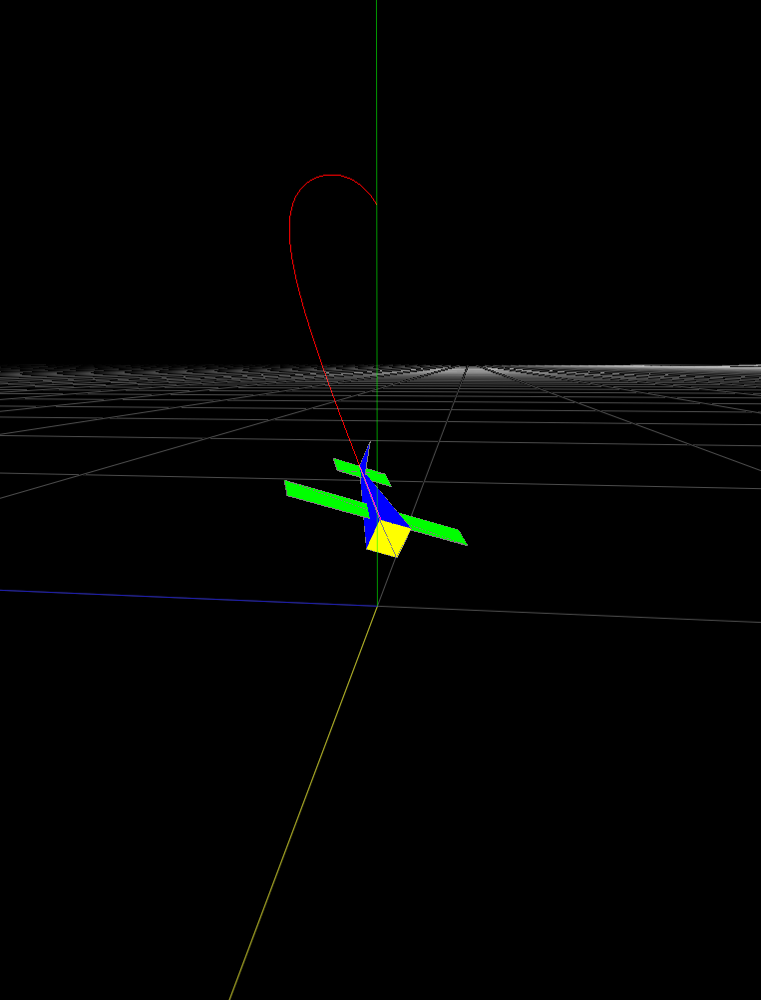
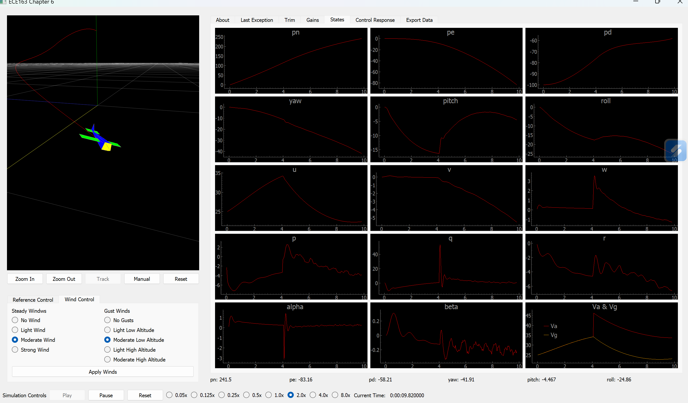
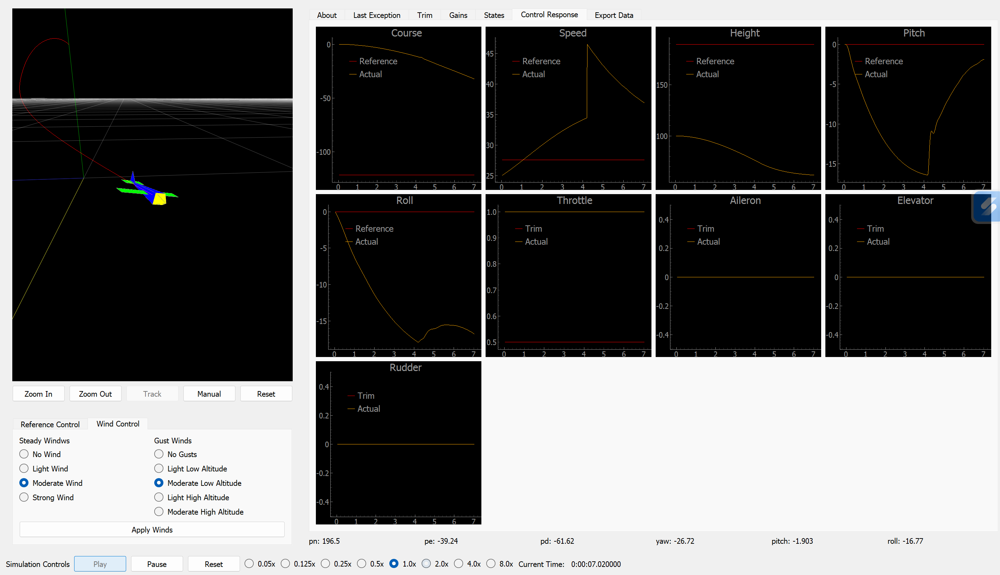
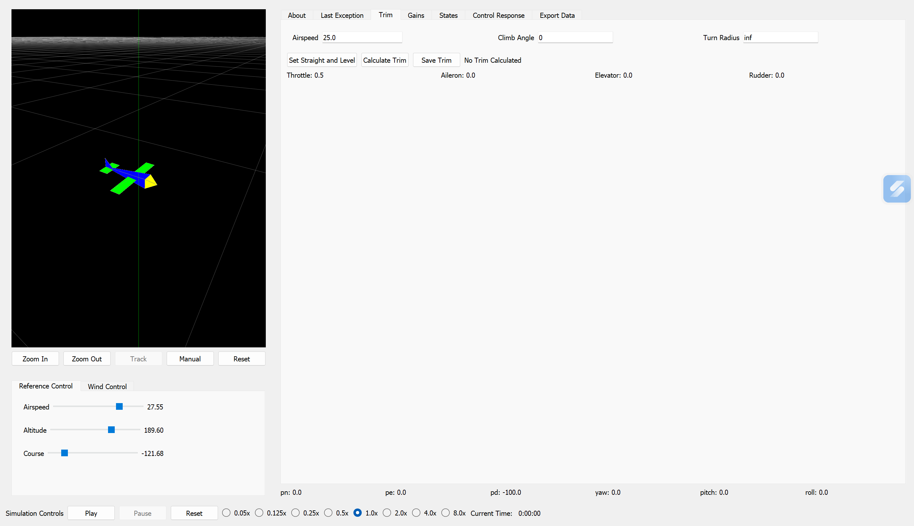
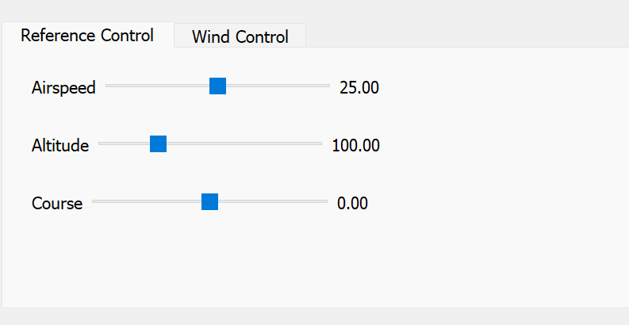
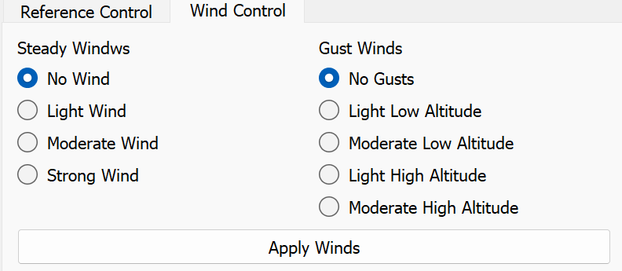

# ECE163 UAV Modeling and Control GUI

A comprehensive Python-based graphical interface for UAV (Unmanned Aerial Vehicle) modeling, simulation, and closed-loop control. This project is developed as part of the UC Santa Cruz ECE163 course and provides an interactive platform for studying aircraft dynamics, aerodynamics, control systems, and estimation theory. Written for Python 3.8+ with PyQt5 for simulation GUI and OpenGL graphics. 


## Table of Contents

- [Project Overview](#project-overview)
- [Project Structure](#project-structure)
- [Modules and Chapters](#modules-and-chapters)
- [GUI Tabs and Features](#gui-tabs-and-features)
- [Getting Started](#getting-started)

---

## Project Overview

This project implements a complete UAV simulation environment that progresses through the first 8 chapters, of "Small Unmanned Aircraft: Theory and Practice" by Beard and McLain, each building upon previous concepts:

**Chapter 2** - Coordinate frame transformations and rotations  

**Chapter 3** - Kinematic simulation (forces in vacuum)  

**Chapter 4** - Aerodynamics and gravity forces  

**Chapter 5** - Trim conditions and path planning  

**Chapter 6** - Closed-loop control with successive loop closure  

**Chapter 7** - Sensor integration and state plotting  

**Chapter 8** - State estimation with Kalman filtering (WIP)

The simulator includes:
- Vehicle dynamics modeling with 12 states (position, velocity, attitude, angular rates)
- Aerodynamic coefficient calculations
- Full 6-DOF (degrees of freedom) rigid body dynamics
- Statistical wind modeling
- Comprehensive sensor suite simulation
- Multiple control architectures

---

## Project Structure

```
aolaez/
├── Chapter2.py through Chapter8.py    # Main entry points for each chapter
├── ece163/
│   ├── Constants/                     # Physical and sensor constants
│   │   ├── VehiclePhysicalConstants.py
│   │   ├── VehicleSensorConstants.py
│   │   └── JoystickConstants.py
│   ├── Containers/                    # Data structures for states, inputs, controls
│   │   ├── States.py
│   │   ├── Inputs.py
│   │   ├── Controls.py
│   │   ├── Sensors.py
│   │   └── Linearized.py
│   ├── Modeling/                      # Vehicle dynamics and aerodynamics
│   │   ├── VehicleAerodynamicsModel.py
│   │   ├── VehicleDynamicsModel.py
│   │   ├── VehicleGeometry.py
│   │   └── WindModel.py
│   ├── Controls/                      # Control loops and estimators
│   │   ├── VehicleClosedLoopControl.py
│   │   ├── VehicleControlGains.py
│   │   ├── VehicleTrim.py
│   │   ├── VehicleEstimator.py
│   │   └── VehiclePerturbationModels.py
│   ├── Sensors/                       # Sensor simulation models
│   │   └── SensorsModel.py
│   ├── Display/                       # GUI components and visualizations
│   │   ├── baseInterface.py           # Core GUI framework
│   │   ├── vehicleDisplay.py          # 3D vehicle visualization
│   │   ├── GridVariablePlotter.py     # Multi-plot grid system
│   │   ├── controlGainsWidget.py      # Control gain tuning interface
│   │   ├── vehicleTrimWidget.py       # Trim calculation interface
│   │   ├── ReferenceControlWidget.py  # Reference command input
│   │   ├── WindControl.py             # Wind condition controls
│   │   ├── DataExport.py              # Data export interface
│   │   └── SliderWithValue.py         # Input slider widget
│   ├── Utilities/                     # Helper functions
│   │   ├── MatrixMath.py              # Matrix operations
│   │   ├── Rotations.py               # Euler angle conversions
│   │   ├── Joystick.py                # Joystick input handling
│   │   └── JoystickMappingTest.py     # Controller configuration tool
│   └── Simulation/                    # Simulation orchestration
│       ├── Simulate.py                # Base simulator class
│       ├── Chapter2Simulate.py through Chapter8Simulate.py
│       └── VehicleSimulation.py
└── TestHarnesses/                     # Unit tests for each chapter
```

---

## Modules and Chapters

### **Constants Module**
Centralized repository for physical parameters:
- Vehicle inertia properties
- Aerodynamic coefficients
- Sensor characteristics
- Control loop gains

### **Containers Module**
Data structure definitions:
- `vehicleState` - 12-state aircraft dynamics
- `sensorOutput` - Simulated sensor readings
- `controlInputs` - Pilot/autopilot commands
- `referenceCommands` - Desired trajectories

### **Modeling Module**
Complete aircraft dynamics pipeline:
- **VehicleAerodynamicsModel** - Combines aerodynamics with vehicle dynamics
- **VehicleDynamicsModel** - 6-DOF rigid body equations of motion
- **WindModel** - Environmental wind conditions
- **VehicleGeometry** - 3D model for visualization

### **Controls Module**
Autopilot implementation:
- **PDControl** - Proportional-Derivative controllers
- **PIControl** - Proportional-Integral controllers
- **VehicleClosedLoopControl** - Hierarchical control architecture
- **VehicleTrim** - Equilibrium point computation
- **VehicleEstimator** - Kalman filtering for state estimation
- **VehicleControlGains** - Linearized model analysis and gain tuning

### **Sensors Module**
Realistic sensor simulation:
- GPS-like position sensing
- Inertial measurement unit (IMU) simulation
- Air data computer (airspeed, altitude)
- Gyroscope and accelerometer noise models

### **Utilities Module**
Mathematical and helper functions:
- `MatrixMath.py` - 3×3 matrix operations
- `Rotations.py` - Euler angle ↔ DCM conversions
- `Joystick.py` - Game controller input processing
- `JoystickMappingTest.py` - Interactive controller calibration

### **Simulation Module**
Orchestrates simulation execution:
- Manages timestep integration
- Handles data recording
- Coordinates visualization updates
- Provides export functionality

---

## GUI Tabs and Features

### Base Interface Layout

The GUI is organized into three main sections:

#### **3D Visualization Pane**
- Real-time OpenGL rendering of aircraft
- Adjustable camera controls (zoom, pan, rotate)
- Vehicle trail plotting to show flight path
- Grid and axis reference frame
- Automatic or manual camera tracking



#### **Output/Analysis Tabs**

**States Tab**
- Real-time plots of 12 vehicle states
- Position: North (pn), East (pe), Down (pd)
- Velocity: Body frame (u, v, w)
- Attitude: Euler angles (yaw, pitch, roll)
- Angular rates: (p, q, r)
- Derived quantities: Airspeed (Va), angle of attack (α), sideslip angle (β)



**Control Response Tab** (Chapters 6-8)
- Reference vs. actual comparison plots
- Course, speed, and height tracking
- Control surface position monitoring
- Trim input visualization



**Trim Tab** (Chapter 6+)
- Interface for computing trim conditions
- Specifies: airspeed, climb angle, turn radius
- Displays: trim control surface positions
- Export trim state for linearization



**Gains Tab** (Chapter 6+)
- Linearized model analysis
- Interactive gain tuning
- Eigenvalue visualization
- Step response plots


#### **Input/Control Tabs**

**Input Sliders** (Chapter 2-4)
- Force inputs (Fx, Fy, Fz) for kinematics
- Moment inputs (Mx, My, Mz) for angular dynamics
- Reset button to return to defaults

**Reference Control** (Chapter 6+)
- Airspeed reference setter
- Altitude/climb rate reference
- Course/heading reference
- Manual override controls



**Wind Control**
- Wind magnitude and direction adjustment
- Real-time wind effect visualization
- Affects aerodynamic forces



---

## Getting Started

### Running Individual Chapters

```bash
# Basic coordinate transformations
python Chapter2.py

# Kinematic simulation
python Chapter3.py

# With aerodynamics
python Chapter4.py

# Trim analysis
python Chapter5.py

# Closed-loop control
python Chapter6.py

# With sensors
python Chapter7.py

# With estimation
python Chapter8.py
```

---

## Key Classes and Interfaces

### Main Simulation Classes

- **`VehicleAerodynamicsModel`** - Primary aerodynamics and dynamics engine
- **`VehicleDynamicsModel`** - 6-DOF rigid body dynamics
- **`VehicleClosedLoopControl`** - Hierarchical autopilot architecture
- **`VehicleEstimator`** - Kalman filter implementation
- **`baseInterface`** - Core PyQt5 GUI framework

### Data Containers

- **`vehicleState`** - 12-state aircraft state vector
- **`sensorOutput`** - Simulated IMU, GPS, air data readings
- **`controlInputs`** - Control surface deflections
- **`referenceCommands`** - Autopilot reference trajectories
